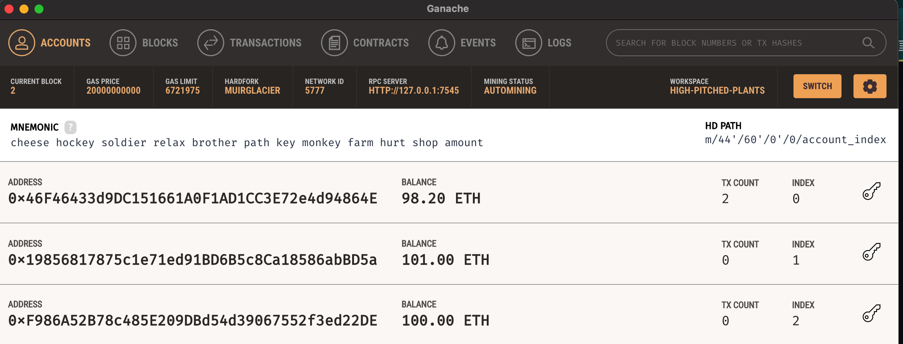
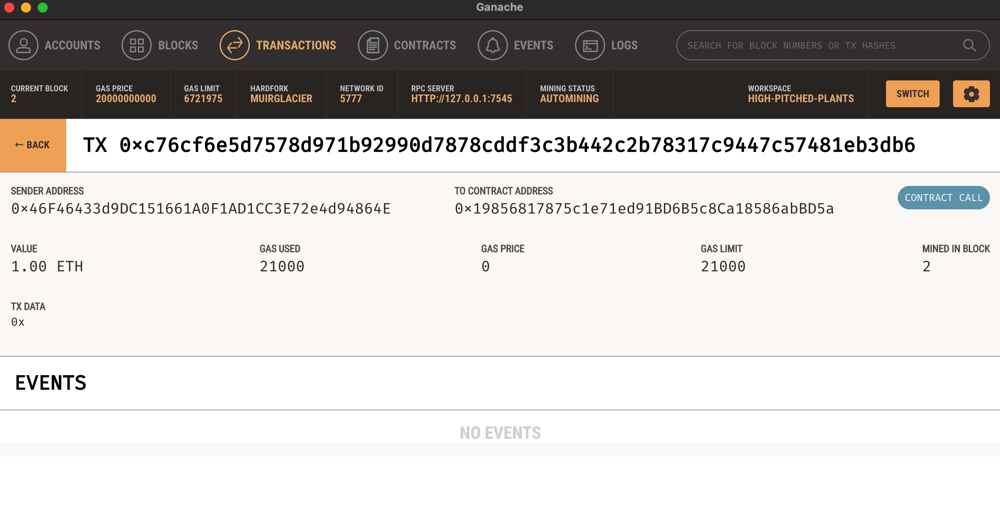

# UW_Fintech_Challenge_19

## Project Description
In this project we integrate two python files that allow us to generate a digital wallet, access Ethereum account balances, and sign and send transactions via a personal Ethereum blockchain called Ganache. The blockchain application is hosted on the web via Streamlit and we verify that our transactions have been completed successfully by using Ganache.  

## Technologies
**Python 3.7**  
**web3**  
**Streamlit**  

## Installation Guide
Before running the application, install Python libraries web3 and Streamlit.  
```pip install web3```  
```pip install streamlit```

## Usage
Navigate to the folder where the fintech_finder.py file is saved. Run the following code to launch the web app:
streamlit run fintech_finder.py.

### In-App Usage
1. Review the fintech professional options.
2. Select the fintech professional you'd like to hire in the left-hand menu.
3. Enter in how many hours you'd like to hire the fintech professional for.
4. Verify the Ethereum address is correct and then click send transaction.  

*Ganache Account Balances after Transaction Sent - Sender & Receiver*
  

*Ganache Transaction Detail*
)


## Contributors
Jacob Vissering  
jake.vissering@gmail.com  
[LinkedIn](https://www.linkedin.com/in/jacobvissering/)
## License
MIT License